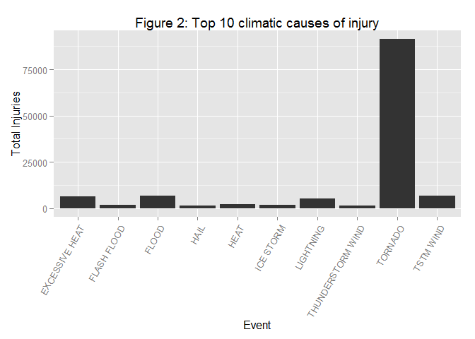

# Human and economic cost of major weather events in  the USA
ARA  
Sunday, July 20, 2014  

This report looks at the top weather events with the highest impact with respect to both human  
and the economic cost.  As both figure 1 and figure 2 shows Tornadoes have the highest human  
cost. Tornadoes caused highest fatalities as well as the maximum injuries.   
However as figure 3 shows Floods had the highest economic impact with floods causing approx 150 billion Dollars in damages measured from 1950, from when the data is available.        
You will also notice that High Wind and Avalanche also caused fatalities,
though the injuries caused by High wind and Avalanche don't figure in the top 10.         
Hailstorms and Ice floods were causes of top 10 injury categories though these don't figure  
in the top causes for fatalities.    
If you then superimpose the economic damage, the damage caused by water related categories seem
to be the most economically devastating.  
There are 3 types of floods, storm surge and drought, all figuring in the top 10 in terms of 
economic impact.
Together they caused 237 billion Dollars worth of damages of the total 409 billion Dollars.

#####  Data Processing

Reading the Storm Data file   
(Assumes that the file is present in the local data folder)


```r
stormData <- read.table("./data/repdata-data-StormData.csv.bz2", header=T, sep = ",")
```

###### Processing for affect to health - Fatality and Injuries
  
Code chunk to identify the top 10 Fatality and the top 10 Injury data  
This is done by totalling the values in FATALITIES and INJURIES columns by each EVTYPE category.   
This is then sorted in descending order or value of total columns  
The top ten by the value are picked to determine the top 10 categories 
   

```r
fa<-aggregate( FATALITIES~EVTYPE, stormData, sum, na.action=na.pass )
topFa <- head(fa[with(fa, order(-FATALITIES)),],10)

inj<-aggregate( INJURIES~EVTYPE, stormData, sum, na.action=na.pass )
topInj <- head(inj[with(inj, order(-INJURIES)),],10)
```

###### Processing for economic impact
Two variables PROPDMGEXP and CROPDMGEXP have the economic data coded.    
The first code chuck is to ensure that the data type is set to character for both these fields.  


```r
stormData$PROPDMGEXP <- as.character(stormData$PROPDMGEXP)
stormData$CROPDMGEXP <- as.character(stormData$CROPDMGEXP)
```

This code chunks ensures a consistent numeric conversion.
Converts the various characters used for coding the  value for the PROPDMGEXP variable.  
The code is self-describing for the conversions used

```r
stormData[stormData$PROPDMGEXP %in% c("-" , "+" , "" , "?","0" , "1", NA), c("PROPDMGEXP")] <-1
stormData[stormData$PROPDMGEXP %in% c("2","h", "H"), c("PROPDMGEXP")] <-2
stormData[stormData$PROPDMGEXP %in% c("3","k", "K"), c("PROPDMGEXP")] <-3
stormData[stormData$PROPDMGEXP %in% c("4"), c("PROPDMGEXP")] <-4
stormData[stormData$PROPDMGEXP %in% c("5"), c("PROPDMGEXP")] <-5
stormData[stormData$PROPDMGEXP %in% c("6","m", "M"), c("PROPDMGEXP")] <-6
stormData[stormData$PROPDMGEXP %in% c("7"), c("PROPDMGEXP")] <-7
stormData[stormData$PROPDMGEXP %in% c("8"), c("PROPDMGEXP")] <-8
stormData[stormData$PROPDMGEXP %in% c("9","b", "B"), c("PROPDMGEXP")] <-9
```

This code chunks ensures a consistent numeric conversion.
Converts the various characters used for coding the  value for the PROPDMGEXP variable.  
The code is self-describing for the conversions used
This is consistent with what is used for PROPDMGEXP


```r
stormData[stormData$CROPDMGEXP %in% c("-" , "+" , "" , "?","0" , "1",NA), c("CROPDMGEXP")] <-1
stormData[stormData$CROPDMGEXP %in% c("2","h", "H"), c("CROPDMGEXP")] <-2
stormData[stormData$CROPDMGEXP %in% c("3","k", "K"), c("CROPDMGEXP")] <-3
stormData[stormData$CROPDMGEXP %in% c("4"), c("CROPDMGEXP")] <-4
stormData[stormData$CROPDMGEXP %in% c("5"), c("CROPDMGEXP")] <-5
stormData[stormData$CROPDMGEXP %in% c("6","m", "M"), c("CROPDMGEXP")] <-6
stormData[stormData$CROPDMGEXP %in% c("7"), c("CROPDMGEXP")] <-7
stormData[stormData$CROPDMGEXP %in% c("8"), c("CROPDMGEXP")] <-8
stormData[stormData$CROPDMGEXP %in% c("9","b", "B"), c("CROPDMGEXP")] <-9
```

Converting Property and Crop exponentials to numeric to enable computations  


```r
stormData$PROPDMGEXP <- as.numeric(stormData$PROPDMGEXP)
stormData$CROPDMGEXP <- as.numeric(stormData$CROPDMGEXP)
```

Calculating the total of property and crop damage for each event  


```r
stormData$TOTDMG <- stormData$PROPDMG *10^stormData$PROPDMGEXP +  stormData$CROPDMG*10^stormData$CROPDMGEXP
```

Aggregating by EVTYPE and picking top 10 only


```r
td<-aggregate( TOTDMG~EVTYPE, stormData, sum, na.action=na.pass )
topTd <- head(td[with(td, order(-TOTDMG)),],10)
```

#####  Results

Loading ggplot2 and xtable library for drawing the plots and creating html tables for the data used


```r
library(ggplot2)
```

```
## Warning: package 'ggplot2' was built under R version 3.1.1
```

```r
library(xtable)
```

Setting up and printing the plot for Fatalities  


```r
p1 <- ggplot(topFa , aes(x = EVTYPE, y = FATALITIES)) + 
      geom_bar(stat = "identity") + 
      theme(axis.text.x = element_text(angle = 60, hjust = 1))+
	    labs(title = "Figure 1 : Top 10 climatic causes of mortality", 
      x = "Event", y = "Total Deaths")

print(p1)
```

 

```r
htopFa<-xtable(topFa[1:10,])
print(htopFa,type='html')
```

<!-- html table generated in R 3.1.0 by xtable 1.7-3 package -->
<!-- Sun Jul 27 22:35:08 2014 -->
<TABLE border=1>
<TR> <TH>  </TH> <TH> EVTYPE </TH> <TH> FATALITIES </TH>  </TR>
  <TR> <TD align="right"> 834 </TD> <TD> TORNADO </TD> <TD align="right"> 5633.00 </TD> </TR>
  <TR> <TD align="right"> 130 </TD> <TD> EXCESSIVE HEAT </TD> <TD align="right"> 1903.00 </TD> </TR>
  <TR> <TD align="right"> 153 </TD> <TD> FLASH FLOOD </TD> <TD align="right"> 978.00 </TD> </TR>
  <TR> <TD align="right"> 275 </TD> <TD> HEAT </TD> <TD align="right"> 937.00 </TD> </TR>
  <TR> <TD align="right"> 464 </TD> <TD> LIGHTNING </TD> <TD align="right"> 816.00 </TD> </TR>
  <TR> <TD align="right"> 856 </TD> <TD> TSTM WIND </TD> <TD align="right"> 504.00 </TD> </TR>
  <TR> <TD align="right"> 170 </TD> <TD> FLOOD </TD> <TD align="right"> 470.00 </TD> </TR>
  <TR> <TD align="right"> 585 </TD> <TD> RIP CURRENT </TD> <TD align="right"> 368.00 </TD> </TR>
  <TR> <TD align="right"> 359 </TD> <TD> HIGH WIND </TD> <TD align="right"> 248.00 </TD> </TR>
  <TR> <TD align="right"> 19 </TD> <TD> AVALANCHE </TD> <TD align="right"> 224.00 </TD> </TR>
   </TABLE>

Table 1 : Fatalities due to weather events

Setting up and printing the plot for Injuries  


```r
p2 <- ggplot(topInj , aes(x = EVTYPE, y = INJURIES)) + 
	    geom_bar(stat = "identity") + 
	    theme(axis.text.x = element_text(angle = 60, hjust = 1))+
	    labs(title = "Figure 2: Top 10 climatic causes of injury", 
	    x = "Event", y = "Total Injuries")

print(p2)
```

 

```r
htopInj<-xtable(topInj[1:10,])
print(htopInj,type='html')
```

<!-- html table generated in R 3.1.0 by xtable 1.7-3 package -->
<!-- Sun Jul 27 22:35:09 2014 -->
<TABLE border=1>
<TR> <TH>  </TH> <TH> EVTYPE </TH> <TH> INJURIES </TH>  </TR>
  <TR> <TD align="right"> 834 </TD> <TD> TORNADO </TD> <TD align="right"> 91346.00 </TD> </TR>
  <TR> <TD align="right"> 856 </TD> <TD> TSTM WIND </TD> <TD align="right"> 6957.00 </TD> </TR>
  <TR> <TD align="right"> 170 </TD> <TD> FLOOD </TD> <TD align="right"> 6789.00 </TD> </TR>
  <TR> <TD align="right"> 130 </TD> <TD> EXCESSIVE HEAT </TD> <TD align="right"> 6525.00 </TD> </TR>
  <TR> <TD align="right"> 464 </TD> <TD> LIGHTNING </TD> <TD align="right"> 5230.00 </TD> </TR>
  <TR> <TD align="right"> 275 </TD> <TD> HEAT </TD> <TD align="right"> 2100.00 </TD> </TR>
  <TR> <TD align="right"> 427 </TD> <TD> ICE STORM </TD> <TD align="right"> 1975.00 </TD> </TR>
  <TR> <TD align="right"> 153 </TD> <TD> FLASH FLOOD </TD> <TD align="right"> 1777.00 </TD> </TR>
  <TR> <TD align="right"> 760 </TD> <TD> THUNDERSTORM WIND </TD> <TD align="right"> 1488.00 </TD> </TR>
  <TR> <TD align="right"> 244 </TD> <TD> HAIL </TD> <TD align="right"> 1361.00 </TD> </TR>
   </TABLE>
Table 2 : Injuries due to weather events

Setting up the ggplot and printing top categories of damage in $ Billions


```r
p3 <- ggplot(topTd , aes(x = EVTYPE, y = TOTDMG/10^9)) + 
      geom_bar(stat = "identity") + 
      theme(axis.text.x = element_text(angle = 60, hjust = 1))+
      labs(title = "Figure 3: Top 10 climate events by Total $ Billion in damage", 
      x = "Event", y = "Total Damage")

print(p3)
```

 

```r
htopTd<-xtable(topTd[1:10,])
print(htopTd,type='html')
```

<!-- html table generated in R 3.1.0 by xtable 1.7-3 package -->
<!-- Sun Jul 27 22:35:09 2014 -->
<TABLE border=1>
<TR> <TH>  </TH> <TH> EVTYPE </TH> <TH> TOTDMG </TH>  </TR>
  <TR> <TD align="right"> 170 </TD> <TD> FLOOD </TD> <TD align="right"> 150319678320.00 </TD> </TR>
  <TR> <TD align="right"> 411 </TD> <TD> HURRICANE/TYPHOON </TD> <TD align="right"> 71913712800.00 </TD> </TR>
  <TR> <TD align="right"> 834 </TD> <TD> TORNADO </TD> <TD align="right"> 57362337155.00 </TD> </TR>
  <TR> <TD align="right"> 670 </TD> <TD> STORM SURGE </TD> <TD align="right"> 43323541000.00 </TD> </TR>
  <TR> <TD align="right"> 244 </TD> <TD> HAIL </TD> <TD align="right"> 18761224827.00 </TD> </TR>
  <TR> <TD align="right"> 153 </TD> <TD> FLASH FLOOD </TD> <TD align="right"> 18243995295.00 </TD> </TR>
  <TR> <TD align="right"> 95 </TD> <TD> DROUGHT </TD> <TD align="right"> 15018672000.00 </TD> </TR>
  <TR> <TD align="right"> 402 </TD> <TD> HURRICANE </TD> <TD align="right"> 14610229010.00 </TD> </TR>
  <TR> <TD align="right"> 590 </TD> <TD> RIVER FLOOD </TD> <TD align="right"> 10148404500.00 </TD> </TR>
  <TR> <TD align="right"> 427 </TD> <TD> ICE STORM </TD> <TD align="right"> 8967041810.00 </TD> </TR>
   </TABLE>
Table 3 : Damage due to weather events

#### Appendix1 : Environment Details


```r
sessionInfo()
```

```
## R version 3.1.0 (2014-04-10)
## Platform: x86_64-w64-mingw32/x64 (64-bit)
## 
## locale:
## [1] LC_COLLATE=English_Australia.1252  LC_CTYPE=English_Australia.1252   
## [3] LC_MONETARY=English_Australia.1252 LC_NUMERIC=C                      
## [5] LC_TIME=English_Australia.1252    
## 
## attached base packages:
## [1] stats     graphics  grDevices utils     datasets  methods   base     
## 
## other attached packages:
## [1] xtable_1.7-3  ggplot2_1.0.0
## 
## loaded via a namespace (and not attached):
##  [1] colorspace_1.2-4 digest_0.6.4     evaluate_0.5.5   formatR_0.10    
##  [5] grid_3.1.0       gtable_0.1.2     htmltools_0.2.4  knitr_1.6       
##  [9] labeling_0.2     MASS_7.3-33      munsell_0.4.2    plyr_1.8.1      
## [13] proto_0.3-10     Rcpp_0.11.2      reshape2_1.4     rmarkdown_0.2.49
## [17] scales_0.2.4     stringr_0.6.2    tools_3.1.0      yaml_2.1.13
```
